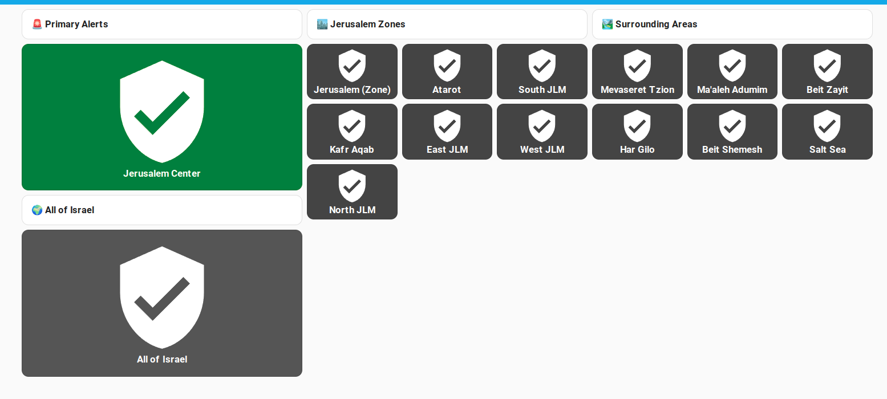
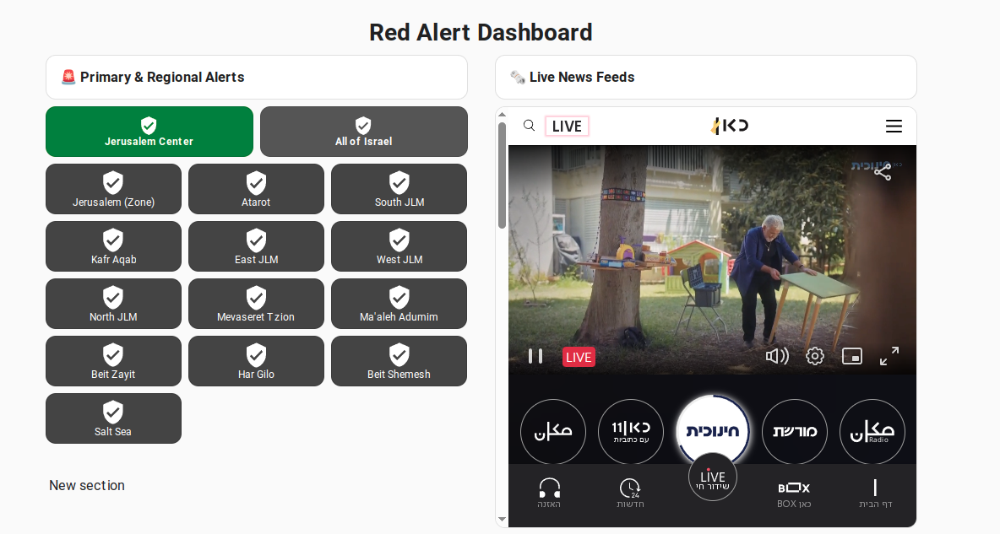
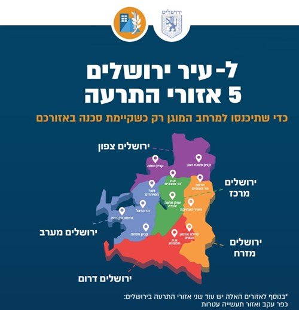
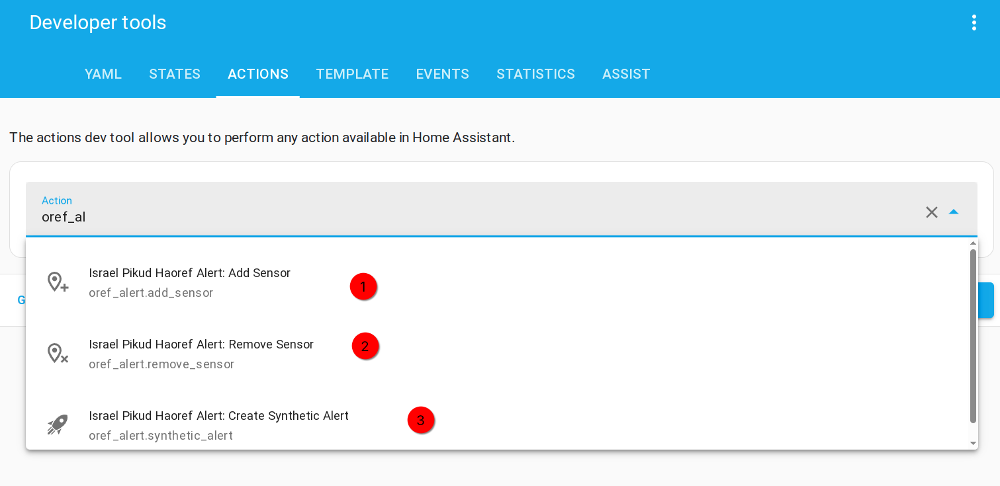
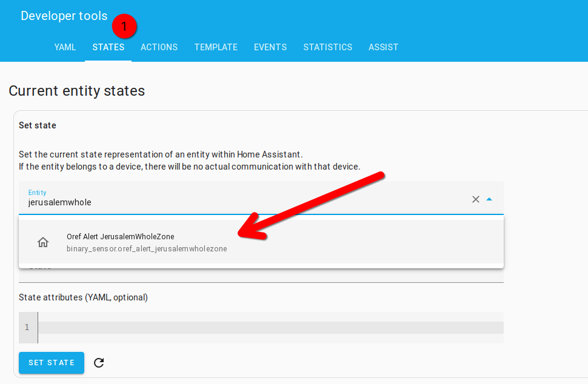

# Home Assistant Dashboard For Red Alerts (Israel)

This project provides a Home Assistant dashboard for monitoring real-time rocket alerts in Israel. It builds upon Amit Fin's [oref_alert](https://github.com/amitfin/oref_alert) integration, offering a visual monitoring solution for multiple alert zones.

## Dashboards

### Alerts only:



News and alerts:

### 

## Disclaimer

This project is not an official Israeli government website, and this dashboard implementation is downstream of Amit Fin's unofficial integration. Therefore, these are not official sources, and you should rely on government information where possible. This serves as a supplementary information source.

## Introduction

This dashboard provides a visual monitoring system for Israel's rocket alerts, allowing you to track alerts across multiple zones simultaneously. It's particularly useful for those living in areas where knowing about alerts in neighboring zones can provide valuable advance warning.

## Why I Made This

During the course of the past year, I've lived through multiple rocket attacks in Jerusalem: the major Iranian ballistic missile attacks and more lately (and frequently) from the Houthis in Yemen. These attacks can occur at any time of the day or night, often when you least expect them. Preparedness is important!

In Jerusalem, as in most of the larger urban areas in Israel, cities are divided into different alerting zones (see illustrative map below from the Jerusalem Municipality):



But in practice, during rocket salvos, it can be difficult to know whether an alert is happening in your zone or in surrounding ones. 

Like most Israelis, I use the official Pikud HaOref app as my main "alerting" system. But the app is intended to focus on one alerting zone. In practice, during rocket salvos, the first indication that something is "going on" comes from a distant alert. Sometimes, it can be heard faintly in the distance. 

For those who've gone to the trouble of setting up these systems, I thought it might be helpful to leverage the useful feature of this integration to create multiple alerting areas in order to create a dashboard that provides a visual "heads up" when required showing your area and adjoining ones.

## Installation

### Prerequisites

- Home Assistant installation
- HACS (Home Assistant Community Store) installed
- [oref_alert](https://github.com/amitfin/oref_alert) integration installed via HACS

### Setup Steps

1. Install the oref_alert integration through HACS
2. Configure the integration to define your primary sensor
3. Add additional sensors for areas you want to monitor
4. Create a dashboard using the provided template

## Configuration

Amit Fin's project works as follows:

- HACS installation for the backbone of the add-on 
- Integration for managing parameters 

You use the integration to define a **primary** sensor.
You use service calls to add **secondary** sensors.

### Available Actions

At the time of writing these are the available actions (the integration needs to be configured for these to become available):
  
| Action Name | Description |
|-------------|-------------|
| `oref_alert.add_sensor` | Adds a new binary sensor for a specific city or area to monitor real-time alerts. |
| `oref_alert.remove_sensor` | Removes a previously added sensor and stops monitoring that city or area. |
| `oref_alert.synthetic_alert` | Triggers a manual (fake) alert for testing automations or visualizations. |

### City Names (Hebrew)

The city names must be passed in Hebrew and correspond at the character level to the official list of alert areas (Hebrew: אזורי ההתרעה).

The extension validates against the list before accepting a service action, so precision is necessary. 

For convenience, these names have been replicated in JSON in this repository under `ref/city-names/cities.json`.

### Adding Alert Sensors

#### Example: Adding A Single Area (Jerusalem Center)

```yaml
action: oref_alert.add_sensor
target: {}
data:
  name: JerusalemCenter
  areas:
    - ירושלים - מרכז
```

#### Example: Adding A Combined Sensor (Multiple Individual Alerting Zones)

Separator: commas.

```yaml
action: oref_alert.add_sensor
target: {}
data:
  name: JerusalemWide
  areas:
    - בית זית
    - בית נקופה
    - הר אדר
    - הר גילה
    - ירושלים - אזור תעשייה עטרות
    - ירושלים - דרום
    - ירושלים - כפר עקב
    - ירושלים - מזרח
    - ירושלים - מערב
    - ירושלים - מרכז
    - ירושלים - צפון
    - מבשרת ציון
    - מעלה אדומים
    - עין נקובא
```

### Finding Your Sensors

Use one service call per alert area that you wish to add:

Note: the major cities in Israel have pre-defined zones that cover the whole city. To find these, search for "כל האזורים" in the list.



I tried and failed to figure out a way to nicely script a bulk addition but in the end just added them individually. As most people will only want a few areas this probably will work for most.

You'll see a little green tick when the action has performed successfully and your additional sensor has been created. 

Then switch over to 'States' and you can confirm that it was created:



To avoid the possibility of failing validation, it's probably easiest to use the UI and paste from the YAML.

Continue until you've added all the areas you need.

Make note of your sensors (the actual device IDs are created by the integration). They should have the common pattern:

`binary_sensor.oref_alert_*`

To retrieve the list, you can paste this string in Template Editor (in Developer Tools):

```

- {{ entity.entity_id }}

```

## Dashboard Creation

Finally, create a dashboard using the sensors you've added. You can use the `dashboard.yaml` file in this repository as a template.

## Composite Blocks

The `cities.json` file contains arrays which might be helpful for configuring sensors consisting of various cities (in their entirety) or parts of them, according to your needs.
